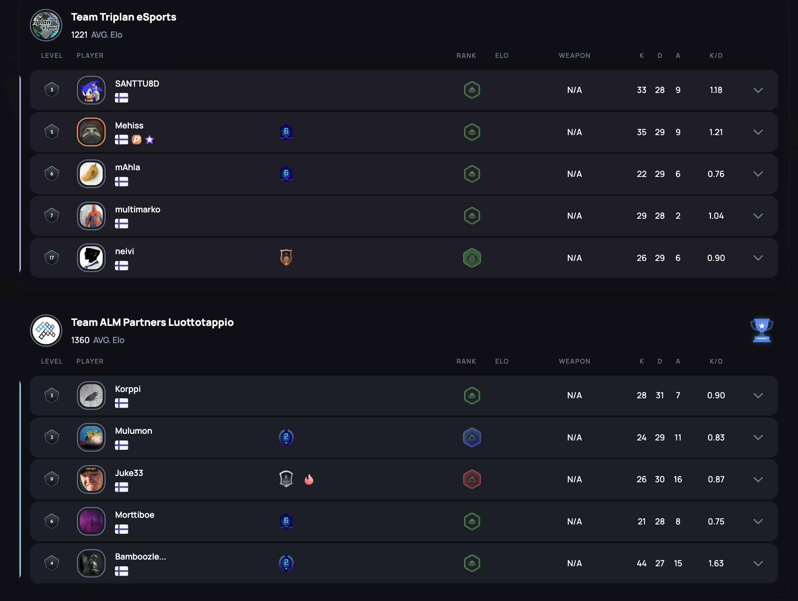
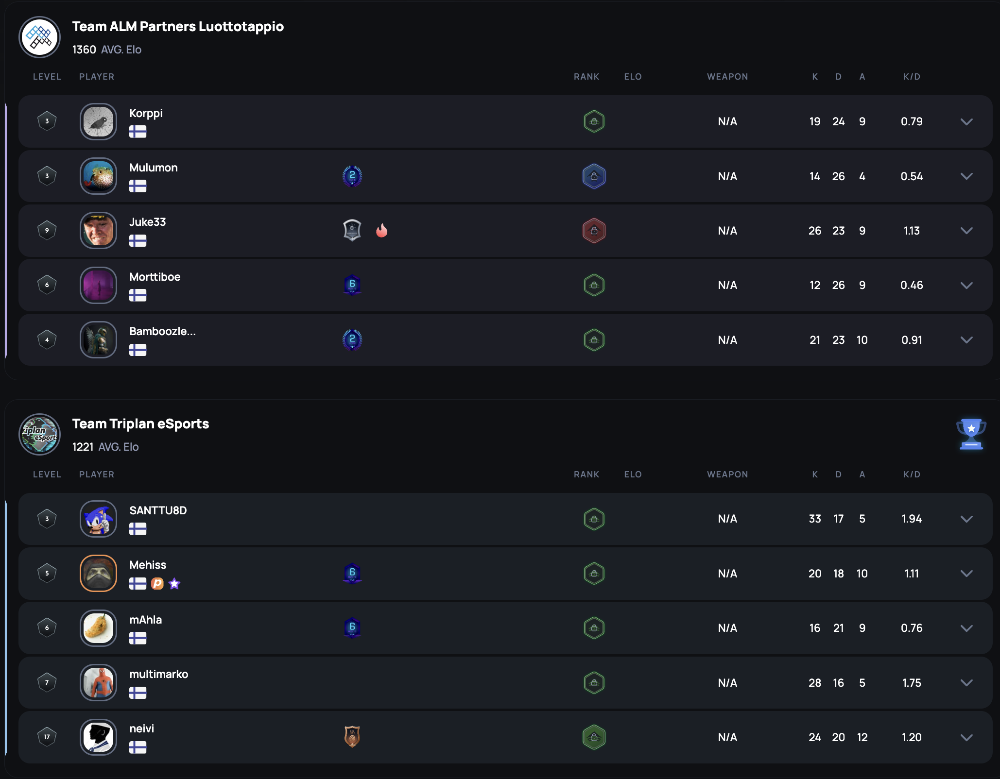
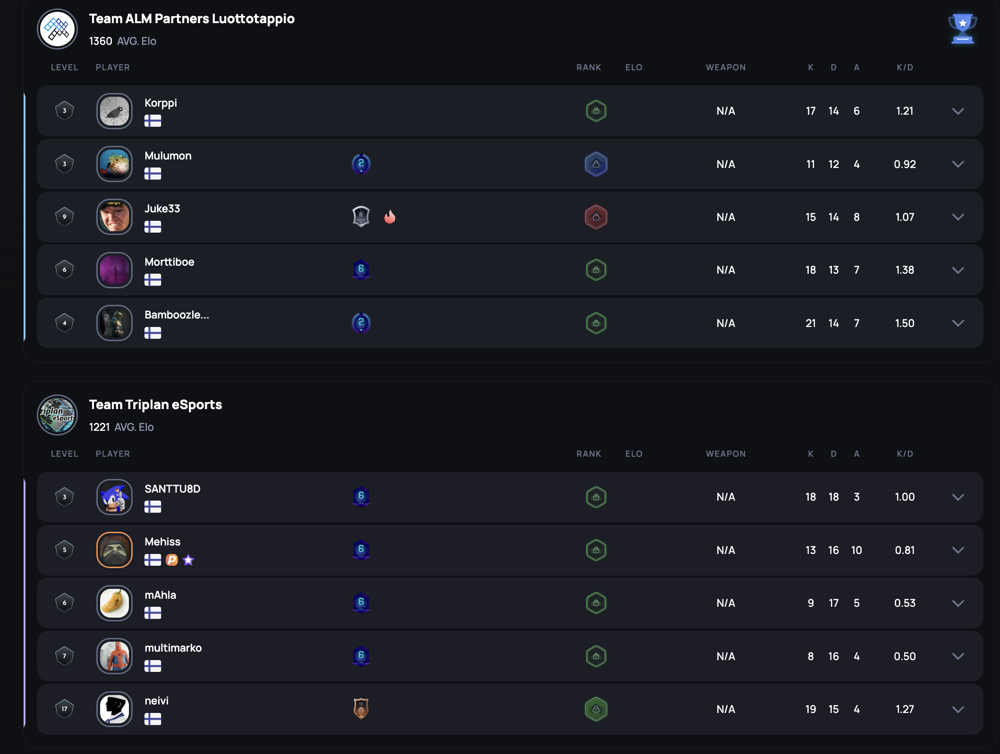

# {{ $frontmatter.title }}

 {{ $frontmatter.league}}

 {{ $frontmatter.datetime }}

Alemman jatkosarjan finaalia pelattiin koko rahan edestä. Ensimmäinen kartta venyi useamman jatkoajan verran, eikä toisessakaan kartassa saatu vielä ratkaisua varsinaisella peliajalla. Kolmas kartta kysyikin jo siis suorituskestävyyttä pelureilta. Molemmat joukkueet joutuivat nöyrtymään omien karttavalintojensa kohdalla vastustajalle. Ja voittajaa lähdettiin hakemaan kolmannesta kartasta.

## Map 1: Nuke 20 - 22

Triplan lähti omaan karttavalintaansa, Nukeen, luottavaisin mielin, vaikka viimekohtaamisessa ALM Partners Luottotappio vei Nuken 13-11. Tällä kertaa Triplan oli kuitenkin tehnyt kotiläksynsä ja oli kehitelty taktiikka jos toinenkin, millä ALM Partners ja eritoten heidän Negeviä rakastava pelaajansa, saataisiin taipumaan.

Hyökkäys kuitenkin takkusi ja BamboozledPepelläkin tuntui Negevin sijaan kiväärikin pysyvän ihan hyvin kädessä, johtaen joukkueensa tilastoja 44 killillä. Ottelusta tuli jälleen tiukka ja ratkaisu löytyi vasta 5. jatkoajalla, jolla ALM Partners kuittasi kartan itselleen.

## Map 2: Ancient 13 - 16

ALM Partners Luottotappio valitsi kartakseen Ancientin, jonka he viime kohtaamisessa veivät suvereenisti 13-3. Tästä tappiosta suivaantunut Triplan palasi Ancientiin pelikirjan kera ja hyökkääminen sujuikin huomattavasti mallikkaammin, kuin edeltävällä kerralla ja siitä Triplan palkittiin jatkoaikavoitolla vieden Ancientin omiin nimiinsä. Joukkueen kapteeni mAhla tarjosi ALM:lle myrkkyä puolustuspuolella flankaten heidät useaan otteeseen mallikkaasti.

## Map 3: Overpass 13 - 8

Viimeiseksi pelattavaksi mapiksi jäi overpass, joka ei ollut kummankaan joukkueen vahvuus, tai näin ainakin luultiin. Triplan oli aikaisemmassa ottelussa varsin suvereenisti voittanut CABB Esports 2 joukkueen 13-3 kyseisessä kartassa, joka varmaankin huolestutti ALM Partnersia, sillä vastoin Triplanin tiedustelutietoja, oli ALM Partnersilla taktiikan tynkää kyseiseen karttaan havaittavissa.

Jo kaksi karttaa jatkoaikoineen alla, alkoi keskittymiskyky kärsimään ja Triplanin puolustaminenkin oli paikka paikoin haastavaa, kartassa, joka selkeästi suosii puolustavaa joukkuetta. Varsinaiset ongelmat alkoivat kuitenkin hyökkäyspuolella ja vaikka Triplan onnistui voittamaan pistoolikierroksen, niin voittoon tarvittavien kierrosten kasaan raapiminen ei vaan millään onnistunut. ALM Partners Luottotappio puolusti komeasti ja sai näin ollen kartan nimiinsä ja voittaen ottelusarjan 2-1.

## Yhteenveto

ALM Partners vei siis todella tasaisen ottelusarjan lopulta nimiinsä 2-1 ja pääsee näin ollen alemman jatkosarjan finaalin voittaneena mittelemään varsinaiseen finaaliin TwoDayn Bean Banditsiä vastaan. Triplania taas kutsuu kesäloma ja muistoksi jäi pronssia kaulaan.

Loppuun vielä Triplanin pelaajan, **Mehiksen**, mietteet ottelusarjasta:

<blockquote class="p-3 italic border-l-4 border-neutral-500 quote">
Tero puolel oli usein turhaa kiire. Muutama execute meni pieleen kommunikoinnin takia. Päästiin hyvään tahtiin ancientin loppu puolel, joka rundi pommi plänätty.
</blockquote>
