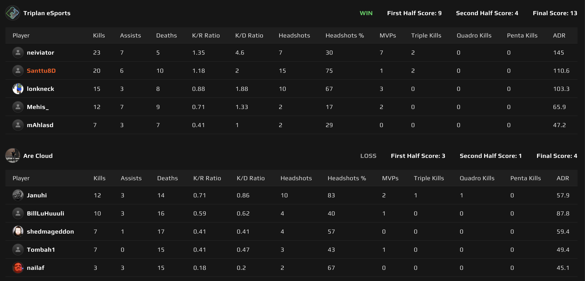
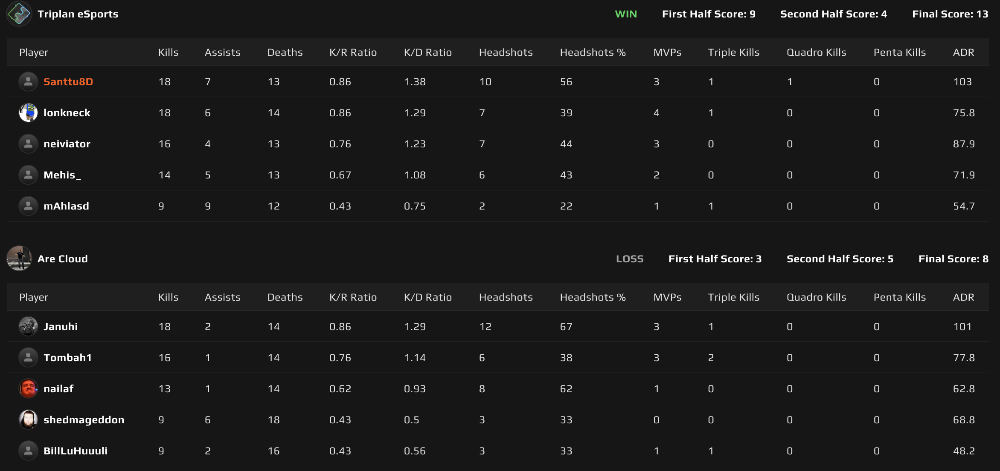

# {{ $frontmatter.title }}

 {{ $frontmatter.league}}

 {{ $frontmatter.datetime }}

Kanaliigan kausi käynnistyi ja Triplanilaiset saivat tulikasteensa Are Cloudia vastaan.

## Map 1: Ancient 13 - 4

Triplanille kelpasi Are Cloudin valitsema Ancient vallan mainiosti, sillä olihan se viime kauden loppupuolella yksi Triplanin vahvimmista mapeista! Triplan hävisi molemmat pistoolikierrokset, mutta eritoten CT-puolella hävitty pistoolikierros ansaitsi Are Cloudille yhteensä 3 kierrosta. Hävittyjä pistoolikierroksia ja niistä johtuneita säästökierroksia lukuunottamatta, ei Are Cloudilla ollut saumaa laisinkaan.

Midi oli tiukassa pidossa _neivin_ ja _Mehiksen_ toimesta puolustaessa. Ei Are Cloudilla ollut Triplanin hyökätessäkään asiaa midiin, sillä Triplanin midiä painoittava hyökkääminen ja eritoten _neivin_ W-näppäin olivat niin timanttisessa iskussa, että taululle kylmät 13 - 4 lukemat ja kohti seuraavaa mappia, Nukea.

## Map 2: Nuke 13 - 8

Nuke alkoi Triplanilla hyökätessä ja varsin hitaasti hyökkäävä Triplan onnistui klaaraamaan tämän puolen 9 - 3 nimiinsä ja peli vaikutti jo olevan aika varmasti "in the bag". Triplanin pistoolikierroksen ehdoton MVP oli _mAhlA_, joka nöyrästi ensin tarjosi maitoa vastustajalle, ansaiten 2 flash assistia ja tämän jälkeen clutchaten 1v3 tilanteen antaen hyökkäyspuolelle räjähtävän startin!

Puolustus ei sitten sujunutkaan ihan niin hyvin. Varmasti osasyynä oli keskittymisen herpaantuminen ja malttamattomuus, kun peli oli tähän asti ollut niin yksisuuntainen. Myös piha tuntui tuottavan merkittäviä ongelmia ja _SANTTU8D_ löysi itsensä hyvin usein vastaanottavana osapuolena, avaten pihan täysin Are Cloudin käyttöön. Tarvittavat 4 kierrosta saatiin kuitenkin kasaan lopulta ja Triplan vei tämänkin kartan nimiinsä 13 - 8.

