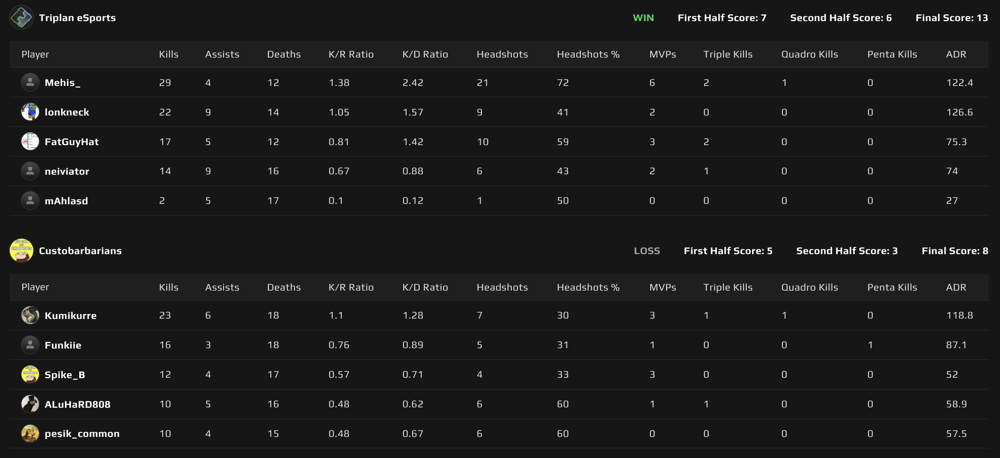
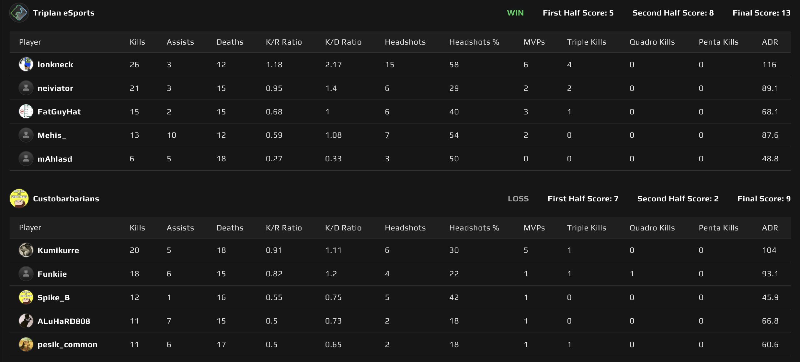

# {{ $frontmatter.title }}

 {{ $frontmatter.league}}

 {{ $frontmatter.datetime }}

## Map 1: Nuke 13 - 8

Custobarbarians valitsi kartakseen Nuken, joten Triplan pääsi aloittamaan puolustamalla, joka yleisesti ottaen on Nukessa se paremmin menestyvä puoli.

Custobarbarians löysi reiän Triplanin puolustusasetelmasta ja pääsikin hyvin usein rampista läpi, missä joukkueen kapteeni _**mAhla**_, oli estämässä barbaarien ryntäystä. Tällä(kin?) kertaa erittäin huonolla internet yhteydellä varustettu Triplanin kapteeni joutui kuitenkin nöyrtymään barbaarien edessä, tehden puolustamisesta pykälän haastavampaa.
Tästä huolimatta, Triplan onnistui kuitenkin keräämään ensimmäisestä puoliskosta 7 kierrosta, joten puolia vaihdettiin tilanteessa 7-5.

Hyökkääminen kulki mallikkaasti Triplanilla ja vaikka kone loppua kohden vähän hyytyikin, niin lopulta kartta Triplanin nimiin 13-8!
_**Mehis**_ oli Triplan eSportsin puolelta **kohtuu hyvällä** pelipäällä, kaataen 29 barbaaria ja omaten 2.48 K/D-ration.

_Mehiksen_ mukaan 10 minuuttia aim traineria ennen peliä tekee ihmeitä ja kyllähän nuo statsit puhuvat sen puolesta! Siitä vinkkiä korvan taakse muillekin.

## Map 2: Anubis 13 - 9

Triplan valitsi kartakseen Anubiksen, joka on ollut varsin suotuisa kartta joukkueelle. Erityisesti hyökkäyspuoli on jotenkin omalla painollaan lähes automaattisesti "vain toiminut".

Barbaarit halusivat aloittaa puolustuksesta, joten Triplanin hyökkäyspuoli saa heti kartan alkuun mahdollisuuden näyttää kyntensä. Custobarbarians hyödynsi midiä puolustaessa ja jos Triplanilta ei sinne savua löytynyt, niin he kyllä tulivat tutkimaan, että mitä siellä juonitaan.

Triplanin hyökkäys suosi B:tä ja barbaarien toinen B-puolen pelaajista tarjosi lyijyä ahkerasti, tehden hyökkäämisestä vaikeaa. Ensimmäinen puolisko 7-5 Custobarbariansin nimiin ja puolten vaihto.

Custobarbariansin hyökkäyksestä ei paljoa jäänyt kotiin kerrottavaa, sillä he ennättivät keräämään vain 2 kierrosta, kun Triplan oli jo saanut tarvittavat kierrokset karttavoittoon 13-9!
Jo ensimmäisessäkin kartassa, Nukessa, kovaa suorittanut _**multimarko (lonkneck)**_ vastasi tällä kertaa scoreboardin kärkipaikasta kaataen 26 barbaaria ja omaten 2.17 K/D-ration.

