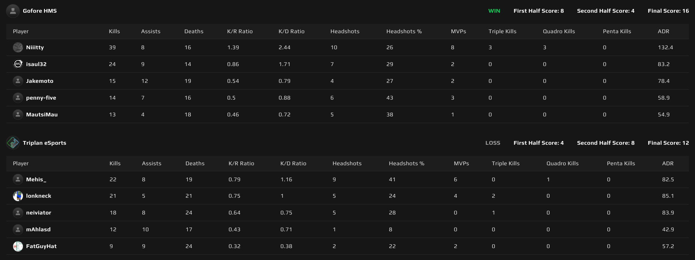
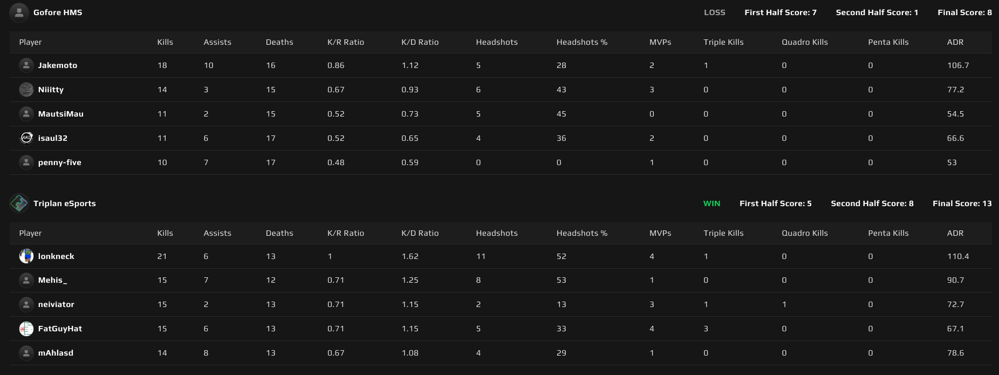

# {{ $frontmatter.title }}

 {{ $frontmatter.league}}

 {{ $frontmatter.datetime }}

## Map 1: Ancient 12 - 16

Triplanin karttavalinta oli Ancient, joka on joukkueen vahvimpia karttoja. Tällä kertaa hyökättiin suoraviivaisemmin, eikä pyritty saamaan midiä haltuun. Gofore puolusti mallikkaasti ensimmäisen puoliskon 8-4 nimiinsä.

Triplanin puolustuspeli oli kuitenkin yhtä vahvaa kuin Goforen, joka hyökätessään pyrki hallitsemaan midiä ja jonka hyökkäykset päätyivät useimmiten B:lle. Toinen puolisko Triplanin nimiin 8-4 ja kohti jatkoaikaa!

Jatkoajalla tukka pöllysi ja Gofore otti sen suvereenisti nimiinsä voittaen jokaisen kierroksen. Goforen _Niiitty_ oli pelipäällä, keräten vakuuttavat 39 tappoa ja rekisteröimään kolme 4K:ta (quadra kill), sekä kolme 3K:ta (triple kill) ottelussa. Ancient Goforen nimiin ja kohti seuraavaa karttaa.

## Map 2: Anubis 13 - 8

Goforen karttavalinta oli Anubis, jossa he olivat viime kierroksella onnistuneet voittamaan oman pelinsä. Triplanin kone yski vielä puolustaessa ja Gofore otti tiukan ensimmäisen puoliskon nimiinsä 7-5.

Puolten vaihdon jälkeen alkoi Triplanilla juna kulkemaan ja vastaavasti Gofore pelasi todella aggressiivisesti haastaen, jonka Triplan hanskasi ottaen avaustapot nimiinsä.

Triplanin duelaaminen oli vahvaa, vieden suurimman osan 1v1:stä. Gofore yllätettiin hyvin usein ns. "housut kintuissa", johtaen Triplanin kierrosvoittoon. Vakuuttava hyökkäyspuoli 8-1 Triplanille ja Anubis Triplanin nimiin, tasaten tämän ottelusarjan 1-1.

