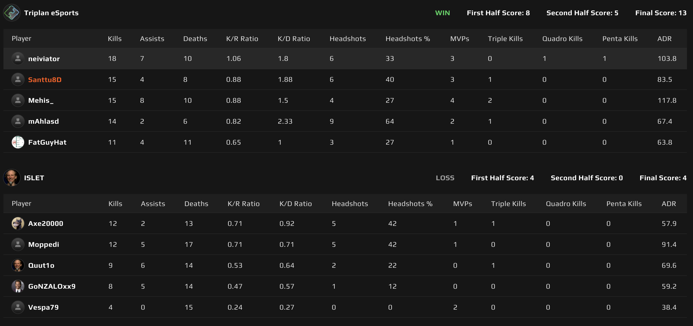
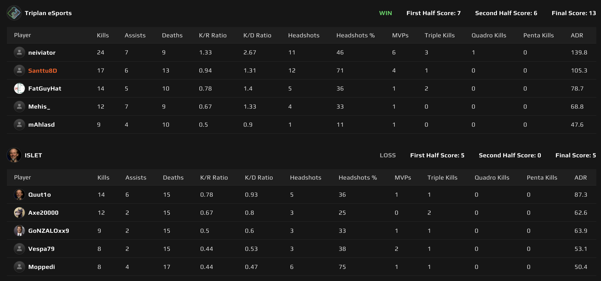

# {{ $frontmatter.title }}

 {{ $frontmatter.league}}

 {{ $frontmatter.datetime }}

## Map 1: Inferno 4 - 13

Kauden toiseksi viimeinen runkosarjan ottelu käyntiin Isletin valitsemalla Infernolla. Triplani päättää aloittaa puolustamalla ja laittaa melkein kaikki munat yhteen koriin, asettaen 4 pelaajaa B-pommipaikalle ja _**SANTTU8D**_ onkimaan tietoa midistä, että mitä Islet pistoolikierroksella aikoo. Islet tulee ryminällä A:lle ja nappaa kierroksen nimiinsä, saaden vahvan aloituksen tähän ottelusarjaan.

Kartan vahvasta alusta huolimatta, ei Isletin hyökkäyspeli onnistunut haalimaan, kuin neljä kierrosta kasaan. Yritystä oli molemmille pommipaikoille, mutta Triplan puolusti, vieden ensimmäisen puoliskon 4-8 nimiinsä.

Puolten vaihdon jälkeen Triplan painoi rutiinilla 5 kierrosta kasaan ja Infernon kruunasi _**neivi**_:n ässät, lopputulokseksi 4-13 ja kartta Triplanin nimiin.

## Map 2: Nuke 5 - 13

Triplan pääsi valitsemaan kartakseen joko Nuken tai Ancientin. Viime otteluissa Ancientia tuli pelattua jo sen verran, että kartaksi valikoitui Nuke. Islet aloitti tämän kartan puolustuksesta ja jälleen Nuken tahmea hyökkäyspeli näytti päätään, sillä ensimmäinen puolisko meni Isletin nimiin 7-5.

Jos Triplanin hyökkäyspeli oli tahmeaa, niin en ole varma, että miten Isletin niin sanottua hyökkäämistä olisi voinut kuvailla, sillä he eivät onnistuneet saamaan kierroksen kierrosta, kun Triplan sai raavittua kasaan tarvittavat 6 kierrosta kartan voittoon 5-13. Ehkä Triplanin puolustus oli vain niin timanttista? 💎

Joka tapauksessa, ottelusarja Triplanin nimiin 0-2 ja Triplan vain vahvistaa entisestään piikkipaikkaansa Kanaliigan 5 divarissa.

