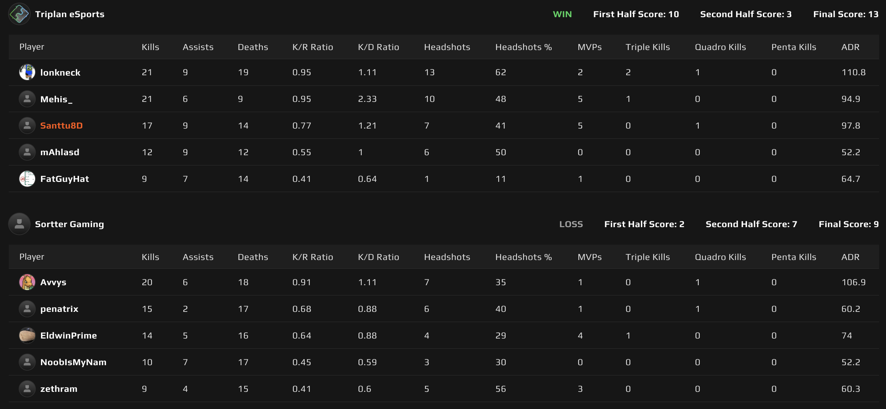
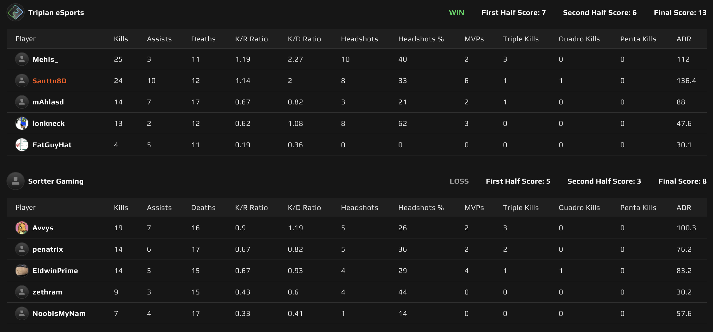

# {{ $frontmatter.title }}

 {{ $frontmatter.league}}

 {{ $frontmatter.datetime }}

Runkosarjan viimeisen ottelusarjan aika ja vastassa Sortter Gaming, joka on lohkon häntäpäässä, omaten vain 1 kartta voiton. Paperilla siis _pitäisi_ olla ihan peruskuntoa kohottava iltahölkkä Triplanin porukalle.

Ongelmat kuitenkin alkoivat jo ennen ottelun alkua, kun _**neiviltä**_ pääsi pelit unohtumaan kokonaan. Onneksi _**lonkneck**_ ehti paikkaamaan ja Triplankin sai 5 ukkoa palvelimelle.

## Map 1: Ancient 9 - 13

Sortter Gamingin valitsi kartakseen Ancientin, joten Triplan pääsi aloittamaan puolustamalla. Puolustus sujui pääosin Triplanilta hyvinkin mallikkaasti.

Midi pysyi hallussa ja Sortterin pelikirja suosikin enemmän suoria hyökkäyksiä pommipaikoille. B:n suora puolustaminen tuotti vähän haasteita Triplanille, mutta suoran torjumisen vaihtaminen retakeemiseen saavutti halutun lopputuloksen ja ensimmäinen puolisko 2-10 Triplanin nimiin.

Hyökkääminen osoittautui Triplanille haastavaksi. Triplanin suosima midin haltuunottoon keskittyvä lähestyminen ontui isosti.

Sortter Gaming sai hyvin laitettua midissä kampoihin liekillä ja _**EldwinPrimen**_ viritetyllä MP9:llä, jolla hän onnistui saamaan useamman Triplanilaisen mukanaan aina, kun midistä kamppailtiin. Paremmalla kommunikaatiolla ja ennen kaikkea maltilla olisi tästä puoliskosta saatu huomattavasti helpompi. 10 kierroksen jälkeen Triplan sai kuitenkin tarvittavat 3 kierrosvoittoa kasaan ja kartta Triplanin nimiin 9-13.

## Map 2: Inferno 8 - 13

Triplan päätti kartakseen Infernon ja Sortter valitsi aloituspuolekseen puolustuksen. Hyökkääminen tuntui taas olevan haastavaa, poislukien jo klassikoksi muodostunutta vesiputousta, jolla jälleen otettiin pistoolikierroksesta helppo voitto!

Hyökkäyksestä tuntui puuttuvan suunnitelmallisuus ja maltti. Vastustajan hirvikivääri hallitsi midiä ja sai sieltä varsin monta "kaatoa". Triplan tuntui menevän lähes joka kierros lopulta B:lle, josta toki saatiin usein pickki jos toinenkin, mutta se pööpöily, mitä edelsi ennen päätöstä päättää kierrosta B:lle, johti usein hyökkäyskaluston harvenemiseen. Tämä taas teki Sortterin retakeemisesta huomattavasti helpompaa. Lopputulokseksi silti 7-5 Triplanille ja kohti puolustamista.

Puolustaminen lähti terävästi käyntiin, kun _**Mehis**_ painoi pistoolikierroksella dualeilla "melkein leffat" länkkäröiden Sortterin pelaajista kolme tonttiin, kun Sortter yritti painaa midistä CT basen kautta B:lle. Muuten puolustamisesta ei oiken ole mitään esille nostettavaa. Sortter yritti vähän kaikenlaista ja Triplan hyvin pitkälti onnistui puolustamaan nämä yritykset. Yhdeksän kierrosta se vaati, että Triplan sai kasaan tarvittavat kuusi kierrosta, vieden kartan 8-13 ja näin ollen ottelusarjan 0-2.

_**FatGuyHatin**_ Inferno oli vähän hiljaisempi ja Valve heitti pientä kuittia kartan loppuruudussa, ilmoittaen, että FatGuyHat sai teurastettua neljä kanaa, joka oli saman verran, kuin hän oli Infernossa onnistunut Sortterin kavereitakin kaatamaan! Ehkä _**Mehiksen**_ mainostama, 10 minuuttia aim traineria ennen peliä, olisi ollut tässä paikallaan parantamassa suoritusta.

Tämä päättää runkosarjan ja Triplan eSportsin ensimmäinen playoff vastustajakin on selvillä. Triplan kohtaa playoffien ensimmäisellä kierroksella Sortter Gamingin uudestaan, tarjoten revanssia tämän kertaisesta ottelusta BO3 muodossa.

