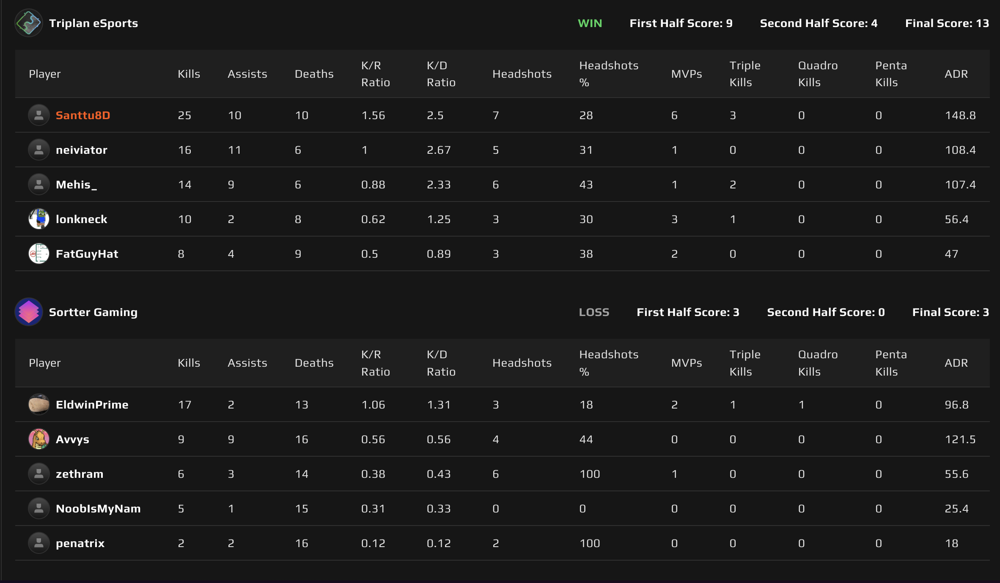
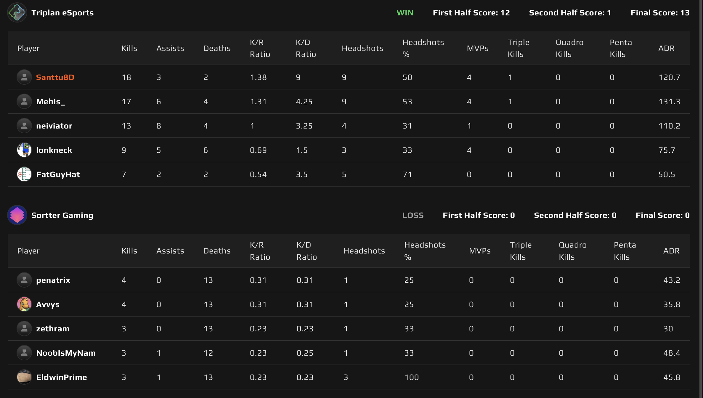

# {{ $frontmatter.title }}

 {{ $frontmatter.league}}

 {{ $frontmatter.datetime }}

## Map 1: Ancient 13 - 3

Sortter Gamingin karttavalinta oli jälleen Ancient ja viimeksi karttahan meni Triplanin nimiin 13 - 9, joten oletettiin tasaista vääntöä.

Pelimiehet alkaa pelaamaan playoffeissa ja tämä piti paikkansa Triplanin porukallakin. Tähän päälle vielä lähimuistissa oleva virkistysilta ja kävi hyvin nopeasti ilmi, että palvelimella ei tänään ollut kuin yksi tiimi pelaamassa. Rutiininomaista ylijuoksua ja kartta Triplanin nimiin 13 - 3

## Map 2: Dust 2 13 - 0

Triplan valitsi kartakseen Dust 2 ja pääsi korkkaamaan kartan hyökkäyspuolelta. Uudella pistoolitaktiikalla saatiin Sortterin lampaat kaitsettua juuri niin kuin haluttiin ja siitä lähtikin sitten niin iso lumipallo pyörimään, ettei Sortter löytänyt enää mitään keinoja Triplania vastaan.

Triplan teki aivan mitä halusi palvelimella ja Sortterilta tulikin ensimmäisen puoliskon jälkeen jo chattiin, ettei tämä enää ollut edes hauskaa. Kartta 13 - 0 Triplanin nimiin ja Sortter Gaming joutui nielemään pölyä katsellessaan, kuinka Triplan kaasutti seuraavalle playoff kierrokselle. Sortter pääsee hakemaan vauhtia lower bracketistä. Heillä on siis viikko aikaa nuolla haavojaan ja yrittää toipua tästä henkisestä selkäsaunasta.

Triplanin seuraava vastustaja on SupermetricsMVP, joka onnistui kukistamaan Custobarbariansin ensimmmäisellä playoff kierroksella. Toivottavasti tästä saadaan vähän tasaisempi ottelu aikaan.

