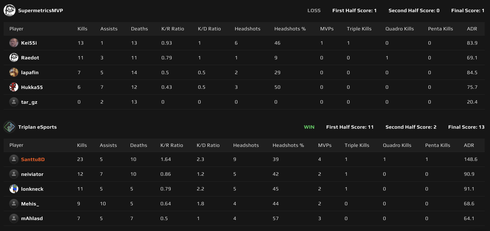
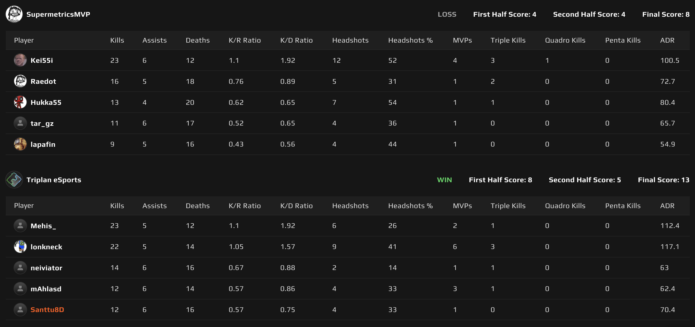

# {{ $frontmatter.title }}

 {{ $frontmatter.league}}

 {{ $frontmatter.datetime }}

## Map 1: Ancient 1 - 13

Ancient valikoitui Triplanin karttavalinnaksi. Tällä kaudella vahva suorittaminen Ancientissa jatkui ja Supermetrics ei ensimmäistä pistoolikierrosta enempää onnistunut kierroksia haalimaan.

Midin haltuunotto oli myrkkyä Supermetricsille ja he joutuivat joka kierros sen luovuttamaan Triplanille, joka hyödynsi tämän annetun tilan ottaen kierrosvoiton kierrosvoiton perään. Supermetricsin _**tar_gz**_ kone vähän yski, eikä hän onnistunut saamaan yhtäkään Triplanilaista kumoon koko kartan aikana. Suvereenia dominointia Triplanin puolelta ja 1 - 13 kartta omiin nimiinsä.

## Map 2: Anubis 8 - 13

Supermetrics päätti kartakseen Anubiksen. Vaikka Triplan on Kanaliigan puolella tämän kartan yleensä voittanut, niin todettakoon, että Faceitin matchmakingin puolella voitot ovat olleet harvassa.

Triplan päätti aloittaa puolustamalla. Parempaa Anubis menestystä lähdettiin hakemaan vaihtamalla B-pommipaikan puolustajien roolia päittään, tarkoittaen, että _**mAhla**_ otti vastuukseen ebox/connectorin pitämisen ja _**SANTTU8D**_ vastaavasti B:n pääsisäänkäynnin puolustamisen.

Vaikka puolustuksen lopputulos olikin 4 - 8 Triplanille, niin se ei kyllä ollut tämän roolin vaihdon ansiota, sillä B-pommipaikan puolustaminen oli yhä varsin hataraa. Supermetrics saikin hyvin usein pommin em. pommipaikalle kiinni ilman sen ihmeellisimpiä taikatemppuja ja B:tä puolustavan parivaljakon menestyksen voi katsoa alta scoreboardista (spoiler: Ei jäänyt paljoa päiväkirjaan kirjoitettavaa).

Hyökkäys eteni omalla painollaan ja edellisen kartan ylivoimaisesta voitosta vähän takkia raottanut Triplan pelaili hyökkäyspuolen taskuunsa ja lopputulokseksi 13 - 8 ja tämäkin kartta Triplanin nimiin.

