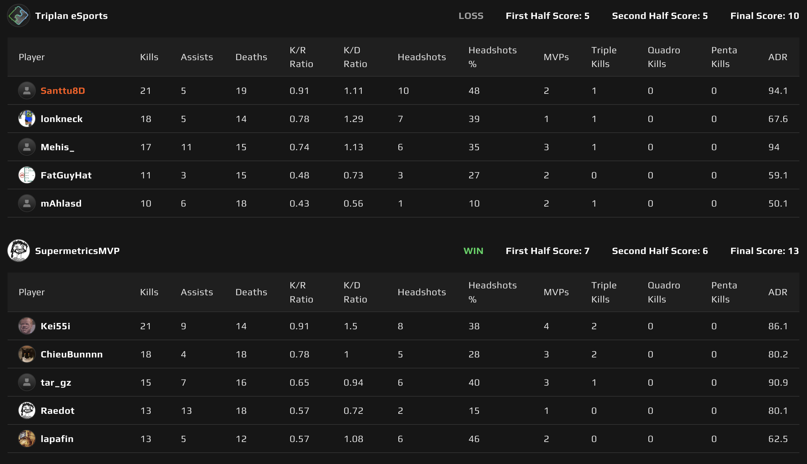
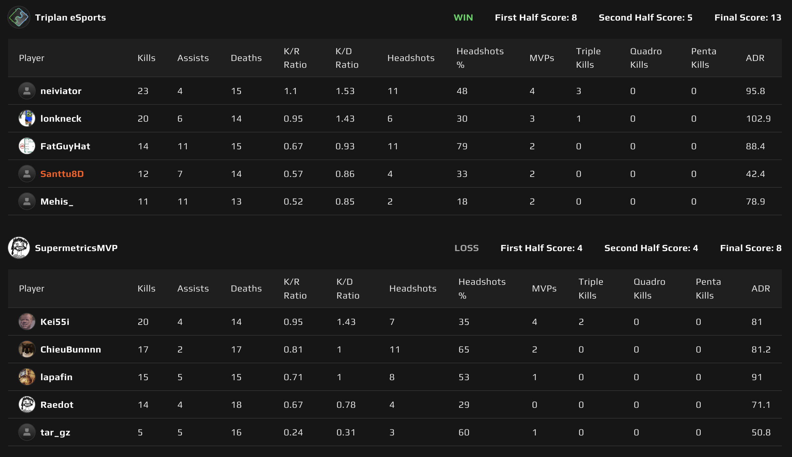
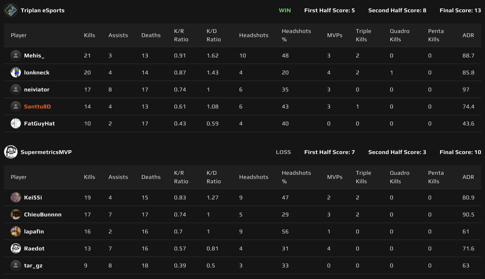

# {{ $frontmatter.title }}

 {{ $frontmatter.league}}

 {{ $frontmatter.datetime }}

## Map 1: Inferno 10 - 13

SupermetricsMVP sai valita ensin karttansa ja he päätyivät Infernoon. Näin ollen Triplan pääsi aloittamaan puolustusasetelmista. Heti ensimmäisellä kierrokslla tulee lunta tupaan, kun Triplan rotatee turhan innokkaasti Supermetricsin feikkaamaan midi puskuun (allekirjoittanut nostaa käden ylös virheen merkiksi!) ja Supermetricsin viisikko heittää vähän vettä korvasta ja rymisten B:lle läpi, jossa ei ollut enää kuin yksi pelaaja ottamassa heitä vastaan.

Supermetricsillä oli hyökkäyspuolella erittäin hyvin malttia, joka palkittiin kierrosvoitoilla. Triplanilla hommaa vaikeutti se, että kapteenilla oli taas sangen epävakaa nettiyhteys ja Triplanin kapteeni löydettiinkin useaan otteeseen warppivan pitkin mappia (jopa tippuen serveriltä kertaalleen). Kartan ensimmäinen puolisko Supermetricsin nimiin 5-7 ja puolten vaihto.

Hyökätessä Triplan avasi pelin klassisella vesiputouksella, joka ei legendojen mukaan ole epäonnistunut vielä kertaakaan! Katsotaan, löytyykö loppu kaudesta vastustajaa, joka tämän yksinkertaisen, mutta sangen tehokkaan taktiikan onnistuu puolustamaan. Tällä kertaa Supermetrics ei voinut, kuin ihailla tätä täydellisyyteensä hiottua suoritusta.

Loppu puolisko meni hyvin tasaisissa merkeissä, mutta vaikka Triplan pääsikin pommipaikalle ja sai pommia kiinni, niin Supermetricsin utility oli varsin vakuuttavaa ja retakeeminen onnistui paremmalla prosentilla, kuin Triplanilla. Kartta Supermetricsin nimiin 10-13 ja kohti Triplanin karttavalintaa.

## Map 2: Dust 2 13 - 8

Triplanin kartta valinta oli Dust 2 ja ennen kuin päästiin karttaa aloittamaan, niin oli aika laittaa kapteeni villaan lagaamaan ja **neiviator** kokoonpanoon! Supermetrics päätti aloittaa puolustamalla ja Triplan laittoi hyökkäyskoneen käyntiin. Longi saatiin hyvinkin helposti haltuun, joka antoi tilaa ja mahdollisuuksia Triplanille työstää karttaa haluamallaan tavallaan. Tämä johtikin erinomaiseen ensimmäiseen puoliskoon 8-4 Triplanille.

Supermetrics aloitti hyökkäämisen myrkyllisen tehokkaasti ja nappasi 3 kierrosta putkeen, jonka jälkeen Triplan sai pakettinsa kasaan. Kapteenin paikan ottanut neiviator oli jalkapallo termein varsinainen "super-sub" ollen scoreboardin kärkipaikalla ja vieden kartan Triplanin nimiin 13-8. Ottelusarja näin ollen 1-1 ja voittajaa lähdetään hakemaan Ancientista.

## Map 3: Ancient 13 - 10

Kolmanneksi kartaksi jäi Ancient, joka joukkueiden viime kohtaamisessa meni Triplanin nimiin 1-13. Tällä kertaa Supermetricsillä oli kuitenkin paras mahdollinen kokoonpano, joten odotettavissa oli huomattavasti tasaisempi kohtaaminen.

Puukkokierroksen jälkeen Supermetrics pääsi aloittamaan puolustuksesta. Triplan onnistui nappaamaan pistoolikierroksen ja sitä seuraavan kierroksen, jonka jälkeen alkoivat hyökkäyspelin haasteet realisoitumaan. Supermetrics kamppaili midistä ja Triplan vuorostaan yritti oman pelikirjansa mukaan ottaa haltuun midiä.

Lukuisista yrityksistä huolimatta Triplan ei saanut midiä haltuun ja **SANTTU8D** kerta toisensa jälkeen ampui vastustajia varpaille heidän tarjotessa pääosumia ja harmaata ruutua takaisin. Kun midistä luovuttiin, onnistui Triplan haalimaan kasaan yhteensä 5 kierrosta, päättäen ensimmäisen puoliskon 5-7 Supermetricsille.

Jos hyökkääminen oli vaikeata Triplanille, niin se oli vielä vaikeampaa Supermetricsille. **Mehis** ja **neiviator** pitivät midin hallussa ja Supermetricsin yritykset kummallekin pommipaikalle onnistuttiin torjumaan varsin hyvällä prosentilla. Supermetrics ehti onnistua hyökkäyksessä vain kolme kertaa, kun Triplan eSports sai kasaan tarvittavat kierrokset karttavoittoon, vieden kolmannen ja ratkaisevan kartan 13-10!

Äärimmäisen tasainen ottelusarja siis Triplanin nimiin 2-1 ja Triplan on yhden pelin päässä finaalipaikasta! Allekirjoittanut uskoo siihen, että Supermetrics hakee vähän vauhtia ja pelikuntoa alemmasta jatkosarjasta ja saapuu vielä finaaliin kokeilemaan uudestaan Triplania vastaan. Saapa nähdä, että miten tuolloin käy!
