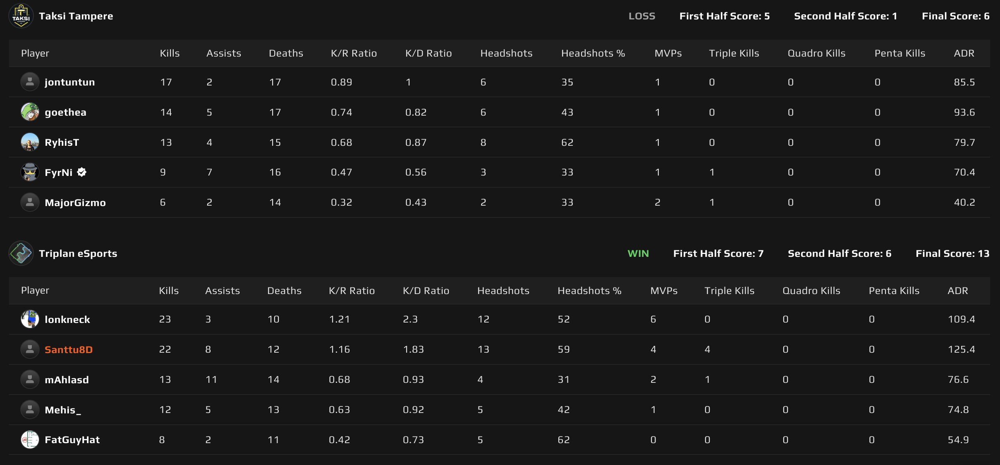
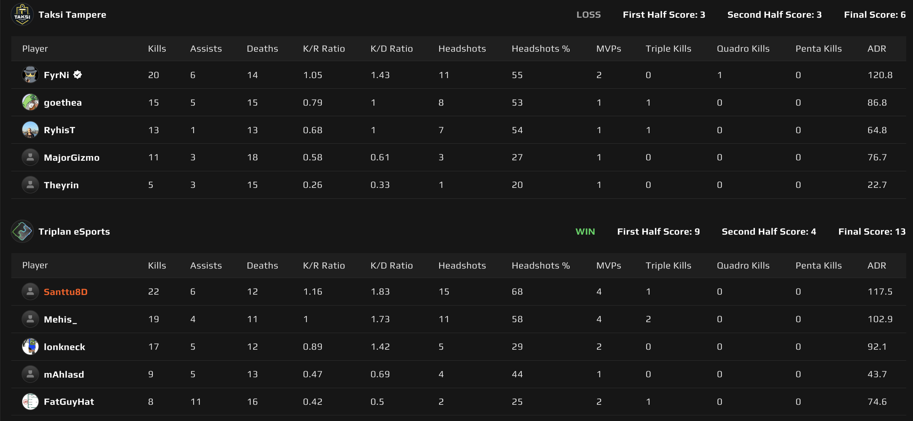

# {{ $frontmatter.title }}

 {{ $frontmatter.league}}

 {{ $frontmatter.datetime }}

## Map 1: Dust 2 13 - 6

Triplanin karttavalinta oli tähän otteluun Dust 2 ja Taksi Tampere päätti aloittaa puolustuspuolelta. Alku oli lupaava Triplanilta, mutta kun vastustaja sai rahapuolen kuntoon ja päästiin asekierroksille, niin puolustuspelaaminen alkoi luistamaan taksikuskeilla. Vahvan alun ansiosta Triplan onnistui kuitenkin viemään ensimmäisen kartan puoliskon 7-5.

Hyökätessä taksikuskeilla oli selvästi raskas kaasujalka ja B:lle tultiin kovalla ryminällä pakokaasun saattelemana. Tästä Taksi Tampere kuittasi itselleen pistoolikierroksen ja samaa temppua yritettiin uudestaan. Tällä kertaa kuitenkin Triplan onnistui retakemaan B:n, sillä muun joukkueen puskiessa tunnelista pommipaikalle, onnistui _**SANTTU8D**_ luikertelmaan savujen läpi saaden varsin herkullisen kulman vastustajiin, jotka olivat täysin keskittyneitä tunneliin. Eli toinen kierros Triplanin nimiin, vaikka kyseessä oli täysi säästökierros Triplanilta.

Tämä selvästi katkaisi jonkinlaisen selkärangan taksikuskeilta, sillä he eivät onnistuneet enää saamaan kierroksen kierrosta nimiinsä hyökkäspuolella, vaan Triplanin puolustus piti ja Dust 2 Triplanin nimiiin 13-6!

## Map 2: Anubis 13 - 6

Taksi Tampere valitsi kartakseen Anubiksen ja Triplan lähti ensimmäiseen puoliskoon hyökkäyspuolelta. Pistoolikierroksen taktiikkana oli B:lle ryminällä ja vaikka savut ja valot menivät mihin sattuivat, onnistui Triplan ottamaan tämän pistoolikierroksen nimiinsä.

Hyökkäys näytti soljuvan Triplanilla hyvin. Varsinkin midin haltuunotto, sekä B:lle meneminen tuotti tulosta. Taksin _**FyrNi**_ laittoi Triplanille erityisesti kampoihin, joista kunniamainintana 4 Triplanilaisen siivoaminen A:lle, kun Triplan yritti vähän sekoittaa pakkaa ja iskeä välillä A:lle. Ei olisi kannattanut! Ensimmäinen puolisko aika yksipuolisen esityksen jälkeen 9-3 Triplanin nimiin.

Toisen puoliskon pistoolikierroksella oli Triplan varautunut kaksilla tupla beretoilla ja "länkkärit" hiljensivät Taksin hyökkäysyrityksen A:lle, tuoden pistoolikierroksen voiton Triplanin nimiin. Kauaa ei Triplan joutunut puolustuksessa hikoilla, vaan tarvittavat kierrokset saatiin kasaan 7 kierroksen aikana ja Anubiskin Triplanin nimiin 13-6. Näin ollen Triplan voitti sarjan 2-0!

