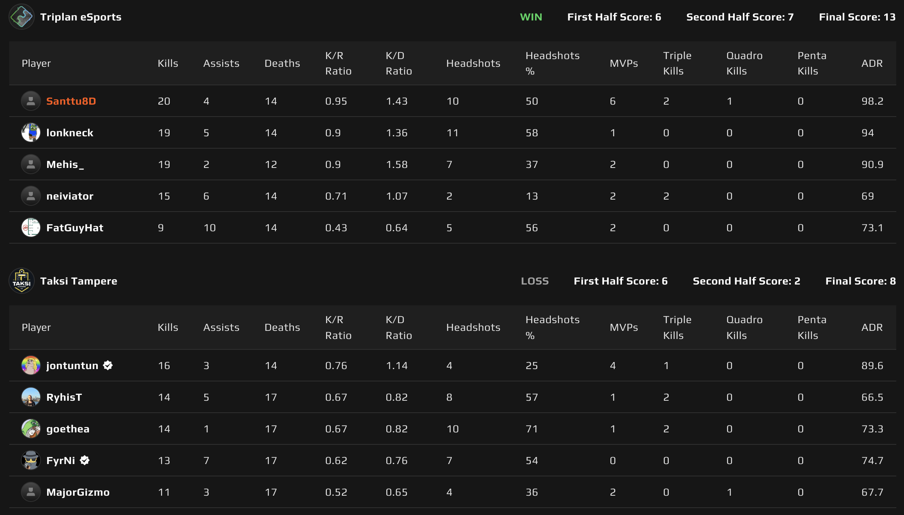
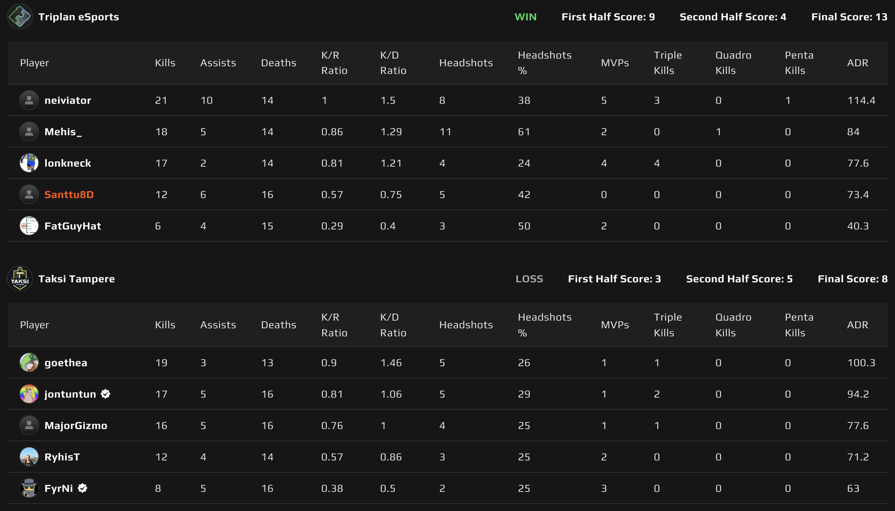

# {{ $frontmatter.title }}

 {{ $frontmatter.league}}

 {{ $frontmatter.datetime }}

## Map 1: Nuke 13 - 8

Taksi Tampere pääsi valitsemaan ensin kartan ja heidän karttansa oli tällä kertaa Nuke. Näin ollen Triplan pääsi aloittamaan puolustusasetelmista ensimmäisen kartan. Taksikuskit koittivat päästä jo ennen pelin alkua ihon alle, kun heidän pelaajansa **MajorGizmo** yritti horjuttaa vastajoukkueen mentaalia kommentoimalla Triplanin veto-taktikointia lobbyn chatissa. Tiedä sitten, että onnistuiko hän tässä vai ei, mutta Taksi Tampere haali pistoolikierroksen omiin nimiinsä ja rullaili sen myötä mukavaan 2-6 johtoon, kun 8 kierrosta oli pelattu.

Vankka johtoasema varmasti myös lisäsi vettä myllyyn MajorGizmolle ja juttua lensi. Triplan kuitenkin päätti joukkueen kesken, että loput otetaan ja näin myös tehtiin. Neljä viimeistä kierrosta Triplanin nimiin, tehden hyökkäyspuolesta edes jotenkin mahdollisen navigoida.

Puolet vaihdettiin ja Taksi Tampere voitti jälleen pistoolikierroksen. Triplan onnistui kuitenkin kääntämään seuraavan kierroksen nimiinsä forceemalla ja yleensä takkuisesti sujuva hyökkäyspeli kulkikin tällä kertaa varsin mallikkaasti. Taksi Tampere onnistui puolustaessaan pistoolikierroksen lisäksi voittamaan vain yhden kierroksen ja Triplanille kartta nimiinsä 13-8, vaikka molemmat pistoolikierrokset hävittiinkin!

## Map 2: Inferno 13 - 8

Triplan päätti kokeilla menestystään Infernossa. Koska kyseessä oli Triplanin karttavalinta, niin Taksi Tampere sai päättää aloituspuolen ja he valitsivat puolustuksen. Triplan avasi pistoolikierroksen jo tutuksi tulleella vesiputouksella ja edelleen se tuotti halutun tuloksen. Vaikkakin se vaati **Mehikseltä** neljä kellokaatoa!

Pistoolikierroksen jälkeen se olikin sitten aivan totaalinen **neivi** show ja Taksi Tampereelta ei yksinkertaisesti löytynyt työkaluja, millä he olisivat neivin pysäyttäneet. Neivi laittoi joukkueen reppuselkään ja hölkkäsi mukavan 9-3 johdon Tripanille, jonka jälkeen oli aika vaihtaa puolia.

Taksi Tampereella varmasti mittari raksutti hyökätessä, sillä joukkueella ei ollut mihinkään kiire! Maltillinen hyökkäyspeli tuntui toimivan ja kartan toinen puolisko olikin varsin tasaista vääntöä. Toista puolta ehdittiinkin jynttäämään 9 kierrosta, kunnes Triplan onnistui saamaan tarvittavat 4 puolustuskierrosvoittoa. Kartta 13-8 Triplan eSportsin nimiin ja ottelusarja näin ikään 2-0 Triplanille!

Tämä voitto tarkoittaa sitä, että Triplan eSports on varmistanut itsellensä finaalipaikan ja siirtyy odottelemaan, että kuka alakaaviosta tulee heitä vastaan. Aiemmin allekirjoittaneen veikkaus siitä, että Supermetrics olisi tulossa finaaliin vastaan, kariutui heti heidän ensimmäiseen peliinsä alakaaviossa. Gofore HMS laittoi Supermetricsin maitojunalla kotiin, vieden sarjan 2-0. Triplan eSportsin vastustaja finaalissa ratkeaakin, kun Custobarbarians ja Gofore HMS saavat selvitettyä kumpi heistä on parempi. Tämän joukkueen voittaja pelaa Taksi Tamperetta vastaan, josta ottelun voittaja pääsee finaaliin Triplan eSportsia vastaan!
