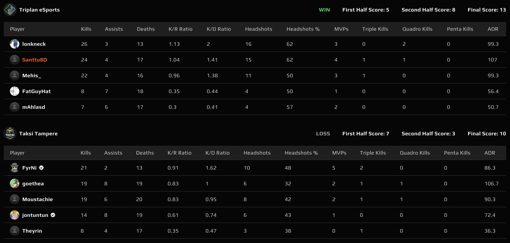
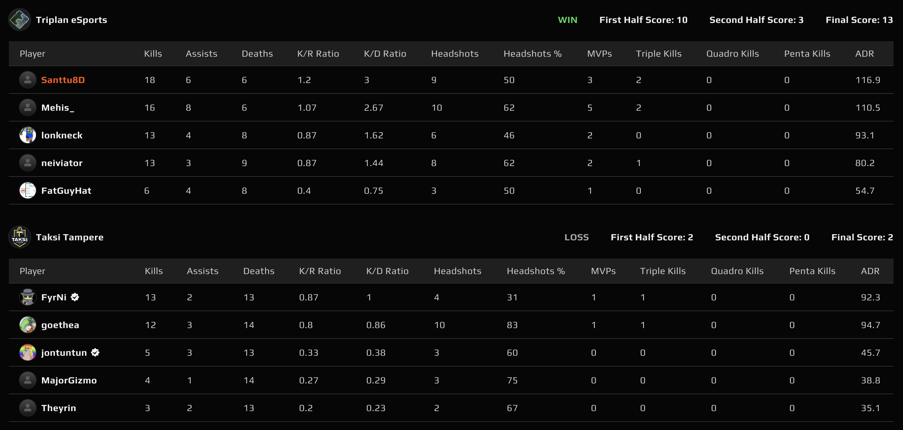

# {{ $frontmatter.title }}

 {{ $frontmatter.league}}

 {{ $frontmatter.datetime }}

## Map 1: Vertigo 13 - 10

Taksi Tampere kaivoi ässän hihastaan ja yritti horjuttaa Triplania valitsemalla kartakseen Vertigon, jota Triplan ei tällä kaudella ole kertaakaan pelannut. Kartta oli myös kuulemma taksikuskien kotikartta ensimmäisellä kaudella.

Täytenä yllätyksenä tullut Vertigo tuntuikin toimivan Taksi Tampereella ja ensimmäisistä seitsemästä kierroksesta he onnistuivat saamaan kasaan kuusi. Kaikki seitsemän oli tarjolla, mutta **lonkneck** onnistui clutchaamaan ilmiömäisesti pistoolikierroksen Triplanin nimiin. Ensimmäinen puolisko päättyikin yllättäen hyökkääjien, eli Taksi Tampereen, nimiin 7-5, vaikka vertigoa pidetäänkin ct-karttana.

Puolten vaihdon jälkeen oli Triplanin vuoro hyökätä ja heikko ensimmäinen puolisko oli ravisteltu mielestä. Triplan sai vahvan alun pistoolikierroksen voiton myötä ja nyt olivat muutkin pelaajat niin sanotusti saapuneet servulle, eikä jouduttu nojaamaan täysin **lonkneckin** clutcheihin, jotta joukkue sai kierroksia nimiinsä. 11 kierrosta ehdittiin toista puoliskoa pelata, kunnes Triplan sai tarvittavat 8 kierrosta nimiinsä (8-3) ja kartta näin ollen 13-10 Triplanin nimiin.

## Map 2: Dust2 13 - 2

Triplan päätyi valitsemaan kartakseen Dust 2, mutta ennen kuin laitettiin kartta käyntiin, oli aika suorittaa pelaajavaihdos ja joukkueen kapteeni, **mAhla**, teki tilaa **neivi**:lle. Hetken aikaa oli niitä kuuluisia teknillisiä ongelmia ja kesti saada molemmille joukkueille oikea line up matsin lobbyyn, mutta lopulta päästiin, kuin päästiinkiin pelaamaan Dust 2:sta.

Taksi Tampere päätti aloittaa jostain syystä hyökkäyksestä. Triplanin puolustus piti vankasti ja vastaavasti Taksi Tampereella tuntui olevan päätöksen teon vaikeutta ja heidän hyökkäyksensä oli hyvinkin hidasta ja päättämätöntä. Ensimmäinen puolisko rutiininomaisesti 10-2 Triplan nimiin ja puolten vaihto.

Kauaa ei toista puoliskoa ehditty pelaamaan, vaan Triplan sai tarvittavat kierrokset kasaan voittamalla kolme kierrosta putkeen, vieden kartan 13-2 nimiinsä ja voittaen tämän finaalisarjan!

Triplan eSports palkittiin koko kauden mittaisesta vahvasta suorittamisesta ensimmäisellä sijalla! 🥇. Samalla tämä on myös joukkueen ensimmmäinen ykkössijoitus. Aikaisempina kausina on toki podiumilla oltu, mutta tällöin kaulaan laitettu mitali ei ole ollut kirkkain mahdollinen!
