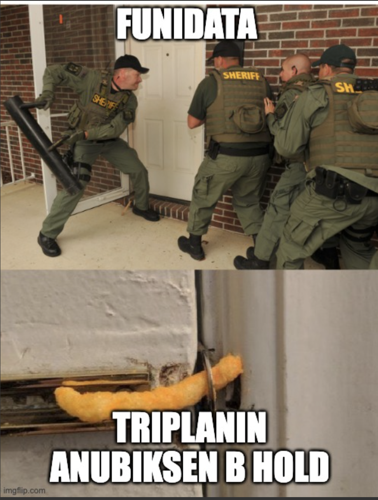
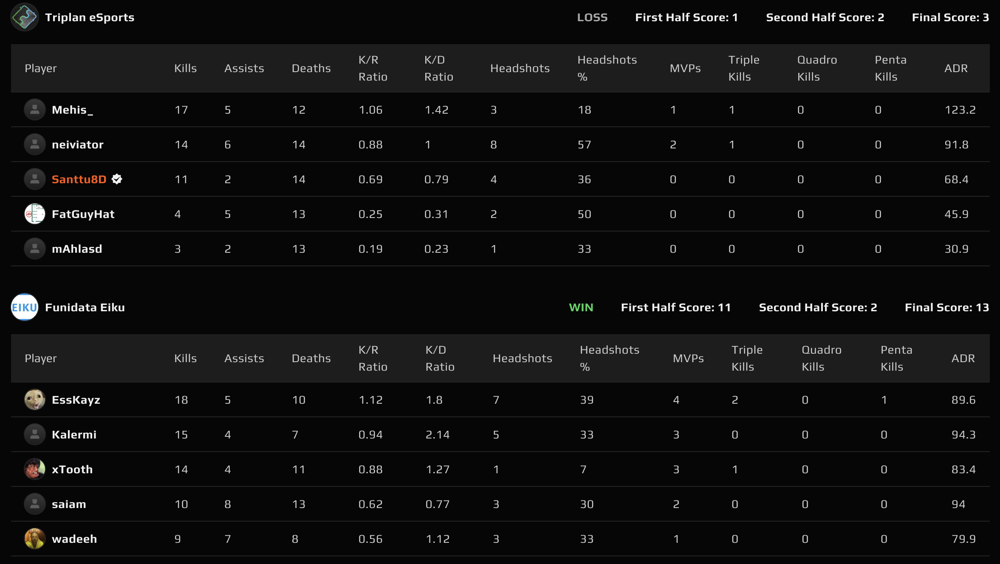
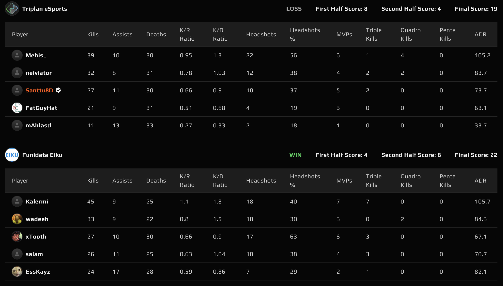

# {{ $frontmatter.title }}

 {{ $frontmatter.league}}

 {{ $frontmatter.datetime }}

Kausi 3 käyntiin ja ensimmäisenä vastustajana Funidata Eiku, joka kahden kauden takaa oli vastassa viimeksi. Tuolloin Triplan voitti molemmat kartat ja nyt oli tarkoitus jatkaa siitä mihin viimeksi jäätiin.

## Map 1: Anubist 3 - 13

Funidatan karttavalinta oli Anubis ja Triplan valitsi aloituspuolekseen puolustamisen(??). Triplanin puolustus oli kuitenkin sangen heikkoa tai sitten Funidatan hyökkääminen erityisen vahvaa, sillä ensimmäinen puolisko meni hyvinkin vakuuttavasti Funidatalle 1-11.

Ehkä seuraava kerta Anubiksessa kertoo, että oliko Funidatan hyökkäys niin vahvaa, vai oliko Triplanin puolustus vain umpisurkeaa (jk lol, Anubis menee banniin jatkossa). Alla kuvamateriaalia Triplanin B pelaajien, _**mAhla**_ ja _**SANTTU8D**_, B setupista:

Toista puoliskoa ehdittiin pelaamaan 4 kierrosta, kunnes Funidata sai kaikki tarvitsemansa kaksi kierrosta kasaan ja kartta näin ollen Funidatan nimiin 3-13. Sangen nöyrä ensimmäinen kartta viime kaudella pyttyä nostaneelle Triplanille.

## Map 2: Dust 2 19 - 22

Triplan valitsi kartakseen Dust 2 ja pääsi korkkaamaan kartan puolustuksesta. Triplan sai ravistettua viime kartan mielestään ja otti vahvan alun Dust 2:lle, vieden ensimmäisen puoliskon nimiinsä 8-4.

Puolten vaihdon jälkeen ainakin allekirjoittanut oli vahvasti sitä mieltä, että 5 rundi kasaan hyökkäyspuolella, how hard can it be? No, ilmeisen vaikeaa. Funidata onnistui puolustamaan yhtä onnistuneesti kuin Triplan ja peli oli tasan 12-12. Jatkoajalle!

Jatkoaikaa pelattiin hyvinkin tasaisissa merkeissä, kunnes Funidata onnistui torjumaan Triplanin hyökkäyspuolen 3-0 ja vastaavasti murtamaan Triplanin puolustuksen puolten vaihdon jälkeen. Kartta Funidatalle 19-22 ja ottelu heidän nimiinsä 0-2.

Suolainen tappio Triplanille, varsinkin kun ottaa huomioon, että _**Mehis**_ oli Dust 2 kuin Team Spiritin _donk_ konsanaan, rekisteröiden 39 tappoa ja yli 100 ADR:n, mutta se ei silti riittänyt. Toivottavasti tämä on uusi standardi Mehikselle ja loppu joukkue pystyisi nostamaan edes vähän tasoaan, että Mehiksen selkä kestäisi koko kauden. Ensi viikolla vastaan asettuu Securitas 3 ja Triplanilla on kasvojen pesun paikka.
