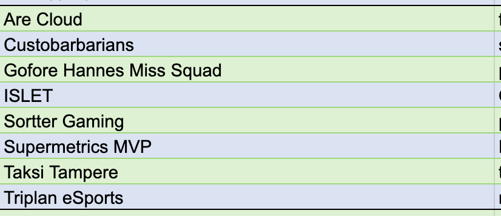

# {{ $frontmatter.title }}

Kanaliigan CS2 toinen kausi starttaa syyskuun alussa! Katsotaan, mistä sarjasta Triplan eSports on itsensä tähän kauteen löytänyt ja löytyykö mahdollisesti vanhoja tuttuja lohkosta! Tarkastellaan myös, että kuinka joukkueen "off-season" on sujunut ja millä mietteillä lähdetään kohti uutta kautta.

## Sarja ja lohkojako

Triplan eSports löytää itsensä tällä kaudella 5. divarista. Vanhoja tuttuja ei löydy kuin Goforen joukkue.

Yleensä alimmasta mahdollisesta sarjasta itsensä löytävä joukkue on joko nostanut tasoaan tai sitten Kanaliigan yleinen taso on laskenut, sillä tällä kertaa divareita on 6, joten ollaan tultu pykälä ylöspäin! Joukkueen bootcampeillä yläkerran saunaosastolla on **selvästi** ollut positiivinen vaikutus!

Runkosarja koostuu 7 kierroksesta ja on kestoltaan 7 viikkoa. Luvassa on siis kutkuttavaa luettavaa otteluraporttien muodossa **joka** viikko!

## Joukkueen kauteen valmistautuminen

Triplan eSports on harjoittelut "kesäkaudella" enemmän tai vähemmän kerran viikkoon. Harjoittelu on koostunut lähinnä pelaamalla Faceit-alustalla viiteen mieheen muita vastaan, mutta on kesään mahtunut myös taktisen kulman terävöittämistä. Kirjoittajan korviin on kantautunut myös sellaista tornihuhua, että nimeltämainitsematon käyttöpalvelupäällikkö olisi nykyään varsinainen utility jumala 👀.

Joukkuetta tällä kaudella edustavat seuraavat pelurit:

- Niko _"mAhlA"_ Turunen
- Juuso _"neivi"_ Laine
- Niilo _"multimarko"_ Keskinen
- Miikka _"Mehis"_ Ylätalo
- Santtu _"SANTTU8D"_ Heleä
- Iiro _"F4tGuyHat"_ Hongisto
- Joona _"Jonukki"_ Nieminen
- Karri _"FoxyGuyHere"_ Lasturanta
