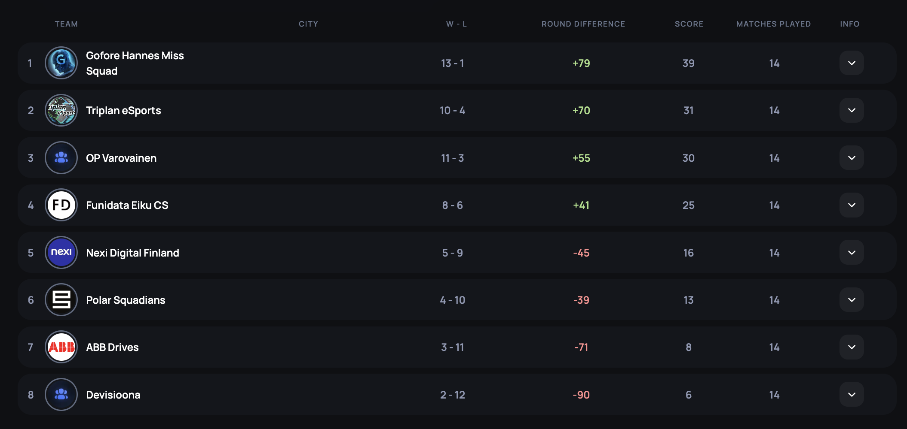
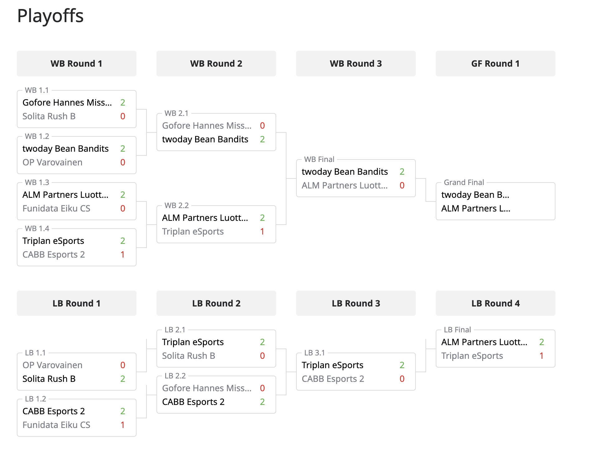

# {{ $frontmatter.title}}

Kanaliiga CS2 Season 1 on saatu päätökseen Triplan eSportsin osalta ja tällä kertaa joukkue ylsi suorituksellaan sijalle 3! On aika tarkastella, että miten kausi kokonaisuudessaan meni. Joukkue kisasi Div 5 tällä kaudella.

## Runkosarja

Runkosarja sujui Triplan eSportsilla varsin mallikkaasti muutamaa kömmähdystä ja keskittymisen herpaantumista lukuunottamatta. Tätä puoltaa myös runkosarjan taulukko, jossa kierrosero oli komeasti 70 rundin verran plussan puolella ja ottelut muutenkin 10-4 (W-L).

Näin jälkeenpäin ajatellen, ehkä jo tässä kohtaa oli paikoittain havaittavissa hyökkäyksen vaikeutta, sillä neljästä hävitystä runkosarjaottelusta 2 oli nukessa, jossa huono hyökkäyspuoli yleensä johtaa häviöön.

Jokatapauksessa, runkosarjan toinen sija ja näin ollen lähdettiin varsin hyvistä asemista kohti playoffeja ja ylempää jatkosarjaa.

## Playoffit

Triplan eSports pääsi aloittamaan ylemmän jatkosarjan kaaviossa näennäisesti helpolla pelillä, koska oli oman lohkonsa runkosarjan toinen ja näin ollen kohtasi toisesta lohkosta huonommin sijouttuneen joukkueen.

### Ylempi jatkosarja

Ylemmässä jatkosarjassa pelit selvästi kovenivat ja jo ensimmäinen ottelusarja CABB Esports 2 vastaan oli tiukka vääntö, missä ratkaisua haettiin nukesta, kun ensin CABB vei overpassin 13-11 ja Triplan klaarasi ancientin 22-19. Nuke osoittautui kuitenkin haastavaksi CABB Esports 2:lle ja Triplan nappasi tästä karttavoiton suvereenisti 13-4 ja eteni ylemmän jatkosarjan seuraavalle kierrokselle.

Toisella kierroksella vastaan asettui ALM Partners Luottotappio ja jälleen haettiin voittajaa kolmen kartan voimin. Ensimmäisenä karttana pelattiin nuke, josta Triplanilla oli luottavainen mieli, sillä olihan viime kierroksella kartta voitettu varsin suvereenisti. Tasaisen väännön jälkeen ALM Partners Luottotappio otti karttavoiton nukesta luvuin 13-11.

Toisena karttana oli ALM Partners Luottotappion valitsema anubis, josta Triplanilla ei ollut vielä yhtäkään ottelua kokemusta joukkueena, joten lähdettiin varsin jännitävissä asemissa kohti anubista. ALM Partnersin yllätykseksi, Triplan kuitenkin onnistui suorastaan varastamaan tämän kartan itselleen 13-6 pakottaen ottelun kolmanteen karttaan, ancienttiin.

Ancientissa tukka pöllysi ja ALM Partners laittoi Triplanin nippuun lähettäen heidät kohti alempaa jatkosarjaa voittaen kartan 13-3 ja näin vieden ottelusarjan 2-1.

### Alempi jatkosarja

Alemmassa jatkosarjassa ensimmäisenä vastaan asettui jo aikaisemmilta kausilta tuttu Solita Rush B. Joukkueiden kohtaamiset ovat päättyneet yleensä Triplanin voittoon ja näin kävi tälläkin kertaa. Triplan kuitasi ensin infernosta karttavoiton 13-5, jonka jälkeen käytiin vielä vähän juoksemassa nukessa, jossa Triplan sinetöi ottelusarjan voittaen kartan 13-4 ja näin ollen lähettäen Solitan Rush B:n kesälomille ja jatkaen itse alemmassa jatkosarjassa eteenpäin.

Toisella kierroksella alemmassa jatkosarjassa, vastaan asettui jo playoffien alusta tuttu CABB Esports 2. Alempaan jatkosarjaan tippumisesta suivaantunut Triplan oli kuitenkin tällä kertaa niin vihaisella pelipäällä, että CABB Esports 2:lla ei ollut tässä ottelusarjassa mitään palaa. Ensin miteltiin nukessa, jonka Triplan korjasi taskuunsa 13-4, minkä jälkeen pelattiin overpass, jonka Triplan voitti jopa 13-3. CABB:in pelaajat kesälomalle ja Triplan lähti hakemaan revanssia ALM Partners Luottotappiota vastaan alemman jatkosarjan finaalista.

Alemman jatkosarjan finaali oli todella tasainen ottelu, jossa kumpikin osapuoli joutui nöyrtymään omassa kartassaan, vieden ratkaisun kolmanteen karttaan. Molemmissa joukkueen omissa kartoissa ei myöskään voittaja selvinnyt varsinaisella peliajalla, vaan karttapistettä haettiin jatkoajalta.

ALM Partners vei Nuken 20-22, Triplan taas ancientin 16-13 ja kolmas kartta, overpass, meni ALM Partnersin nimiin 13-8. Näin ollen ALM Partners Luottotappio pääsi taistelemaan kirkkaimmasta mitalista ja Triplanille kuparia kaulaan ja kesälaitumille. Tarkempi otteluraportti on luettavissa [täältä](../match-reports/kanaliiga-cs2-season-1/ALM-Partners-Luottotappio_20240423.md) tähän eeppiseen alemman jatkosarjan finaaliin.

## Yhteenveto

Triplan eSports päätti siis Kanaliiga CS2 Season 1-turnauksen lopulta kolmanteen sijaan. Runkosarjassa ei ihan lohkovoittoon yletytty, mutta runkosarjan kakkossija vei ylempään jatkosarjaan.

Playoffeissa pelit olivat tasaisia ja tiukkoja ja Triplan paransi ottelu ottelulta otettaan. Joukkue nosti tasoaan selvästi tiputtuaan ylemmästä jatkosarjasta alempaan jatkosarjaan, jonka jälkeen mm. hyökkääminen sujui mallikkaammin. Tästä loistava esimerkki on alemman jatkosarjan finaalissa ALM Partners Luottotappiota vastaan ancientin voittaminen 16-13, kun aikaisemmassa kohtaamisessa tuli lunta tupaan 13-3.

Nähtäväksi jää, että mitä kaikkea joukkue keksiikään ensi kautta varten ja josko silloin päästäisiin jo viemään poika yläkerran saunaosaston saunaan! 😎
