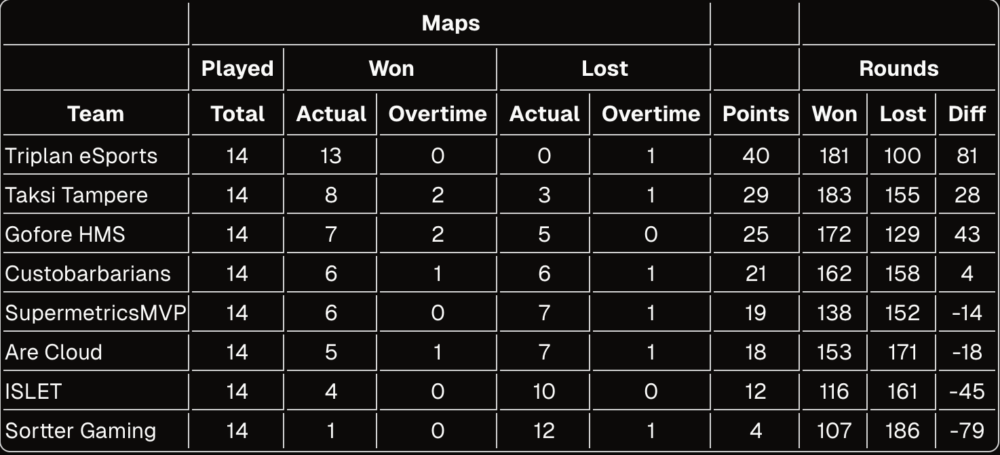

# {{ $frontmatter.title}}

Kanaliiga CS2 Season 2 on taputeltu ja Triplan eSports meni tällä kertaa päätyyn asti ja onnistui voittamaan Div 5 -sarjan!

## Runkosarja

### [Triplan eSports vs Are Cloud (04.09.2024)](../match-reports/kanaliiga-cs2-season-2/Are-Cloud_20240904.md)

Kausi alkoi vahvasti, kun Triplan kohtasi Are Cloudin. Ensimmäinen kartta, Ancient, päättyi Triplanin voittoon 13-4. Nukessa Triplan jatkoi vahvaa suorittamista ja voitti 13-8. Aina mukavaa aloittaa kausi voitolla!

### [Triplan eSports vs Gofore HMS (12.09.2024)](../match-reports/kanaliiga-cs2-season-2/Gofore-HMS_20240912.md)

Seuraavassa ottelussa Triplan kohtasi Gofore HMS:n. Ancient oli tiukka, mutta Gofore vei sen jatkoajalla 12-16. Tämä oli toinen niistä, kartoista, jonka Triplan hävisi koko kaudella! Triplan kuitenkin tasoitti ottelun voittamalla Anubis-kartan 13-8.

### [Triplan eSports vs Taksi Tampere (18.09.2024)](../match-reports/kanaliiga-cs2-season-2/Taksi-Tampere_20240918.md)

Triplan kohtasi Taksi Tampereen ja voitti molemmat kartat. Dust 2 päättyi 13-6 ja Anubis 13-6 Triplanin hyväksi.

### [Triplan eSports vs Custobarbarians (23.09.2024)](../match-reports/kanaliiga-cs2-season-2/Custobarbarians_20240923.md)

Triplan kohtasi Custobarbariansin ja voitti molemmat kartat. Nuke päättyi 13-8 ja Anubis 13-9 Triplanin hyväksi.

### [Triplan eSports vs Supermetrics (30.09.2024)](../match-reports/kanaliiga-cs2-season-2/Supermetrics_20240930.md)

Supermetricsin odotettiin olevan kova vastus, mutta Triplan onnistui voittamaan Ancient-kartan 13-1 ja Anubis-kartan 13-8. Tämä voitto oli tärkeä askel kohti playoffeja.

### [Triplan eSports vs Islet (02.10.2024)](../match-reports/kanaliiga-cs2-season-2/Islet_20241002.md)

Islet-ottelussa Triplan jatkoi vahvaa suorittamista. Inferno päättyi 13-4 ja Nuke 13-5 Triplanin hyväksi. Tämä voitto varmisti Triplanin paikan ylemmässä jatkosarjassa.

### [Triplan eSports vs Sortter Gaming (16.10.2024)](../match-reports/kanaliiga-cs2-season-2/Sortter-Gaming_20241016.md)

Runkosarjan viimeisessä ottelussa Triplan kohtasi Sortter Gamingin. Ancient-kartta päättyi 13-9 ja Inferno 13-8 Triplanin hyväksi. Tämän voiton myötä Triplan oli virallisesti runkosarjan voittaja.

## Playoffit

### [Triplan eSports vs Sortter Gaming (30.10.2024)](../match-reports/kanaliiga-cs2-season-2/Sortter-Gaming_20241031.md)

Playoffien ensimmäisellä kierroksella Triplan kohtasi Sortter Gamingin uudestaan. Ancient päättyi 13-3 ja Dust 2 13-0 Triplanin hyväksi. Rutiininomaisella suorituksella seuraavalle kierrokselle ja Sortter alempaan jatkosarjaan.

### [Triplan eSports vs SupermetricsMVP (06.11.2024)](../match-reports/kanaliiga-cs2-season-2/Supermetrics_20241105.md)

Toisella playoff-kierroksella Triplan kohtasi SupermetricsMVP:n. Inferno päättyi 10-13 Supermetricsin hyväksi, mutta Triplan voitti Dust 2 13-8 ja Ancient-kartan 13-10, voittaen ottelusarjan 2-1. Inferno oli se toinen kartoista, jonka Triplan tällä kaudella hävisi.

### [Triplan eSports vs Taksi Tampere (13.11.2024)](../match-reports/kanaliiga-cs2-season-2/Taksi-Tampere_20241113.md)

Kolmannella playoff-kierroksella Triplan kohtasi Taksi Tampereen. Ensimmäinen kartta, Nuke, päättyi 13-8 Triplanin hyväksi. Toinen kartta, Inferno, päättyi myös 13-8 Triplanin hyväksi. Tämä voitto varmisti Triplanin paikan finaalissa.

## Finaali

### [Triplan eSports vs Taksi Tampere (04.12.2024)](../match-reports/kanaliiga-cs2-season-2/Taksi-Tampere_20241204.md)

Finaalissa Triplan kohtasi Taksi Tampereen. Ensimmäinen kartta, Vertigo, päättyi 13-10 Triplanin hyväksi. Dust 2 Triplan laittoi jalan kaasulle ja voitti 13-2, varmistaen mestaruuden.

## Joukkueen Pelaajapalkinnot

Alla Triplan eSportsin pelaajien statistiikkaa, joissa sulkujen sisällä keskiarvolukema per peli:

| Pelaaja       | Pelatut | Tappoja     | Assisteja      | Kuolemia        | Damage              | ADR       | HS         | UtilDMG           | FK (First Kills) | FD (First Deaths) | Clutcheja    | Flash-avustuksia | HS%     | KANA     |
| ------------- | ------- | ----------- | -------------- | --------------- | ------------------- | --------- | ---------- | ----------------- | ---------------- | ----------------- | ------------ | ---------------- | ------- | -------- |
| **Mehis**     | **23**  | 396 (17.22) | 150 (6.52)     | 255 (11.09)     | **41196 (1791.13)** | 90.9      | 179 (7.78) | **2559 (111.26)** | 49 (2.13)        | 20 (0.87)         | **5 (0.22)** | 16 (0.70)        | 45%     | 1.06     |
| **lonkneck**  | 21      | 382 (18.19) | 94 (4.48)      | 259 (12.33)     | 37571 (1789.10)     | 88.7      | 169 (8.05) | 1912 (91.05)      | 59 (2.81)        | 37 (1.76)         | 4 (0.19)     | 1 (0.05)         | 44%     | 1.02     |
| **SANTTU8D**  | 19      | 354 (18.63) | **113 (5.95)** | 231 (12.16)     | 36395 (1915.53)     | **102.2** | 174 (9.16) | 2143 (112.79)     | **81 (4.26)**    | **46 (2.42)**     | 4 (0.21)     | 11 (0.58)        | **49%** | **1.13** |
| **FatGuyHat** | 19      | 189 (9.95)  | 104 (5.47)     | **250 (13.16)** | 21744 (1144.42)     | 56.7      | 80 (4.21)  | 893 (47.00)       | 22 (1.16)        | 21 (1.11)         | 2 (0.11)     | 1 (0.05)         | 42%     | 0.72     |
| **neivi**     | 17      | 293 (17.24) | 109 (6.41)     | 208 (12.24)     | 29144 (1714.35)     | 90.3      | 101 (5.94) | 1867 (109.82)     | 48 (2.82)        | 36 (2.12)         | 1 (0.06)     | 8 (0.47)         | 34%     | 1.01     |
| **mAhla**     | 16      | 157 (9.81)  | 102 (6.38)     | 211 (13.19)     | 18327 (1145.44)     | 56.6      | 53 (3.31)  | 719 (44.94)       | 14 (0.88)        | 24 (1.50)         | 2 (0.13)     | **21 (1.31)**    | 34%     | 0.71     |

### 🏆 **Kauden Tilastohaukka**

**Voittaja**: **SANTTU8D**

- **Perustelu**: Korkein ADR (102,2) ja KANA-rating (1,13), mikä todistaa, että ei ole muuta tehty, kuin keskitytty tilastoihin koko kauden ajan. Me kaikki tiedämme, että tämä oli oikeastaan vain numeropeli.

### 🔥 **Grillimestari**

**Voittaja**: **Mehis**

- **Perustelu**: Eniten utility-vahinkoa (2559), mikä osoittaa osaamista incendary/molotov- ja HE-kranaattien käytöstä.

### 🏋️ **Ironman-palkinto**

**Voittaja**: **Mehis**

- **Perustelu**: Pelasi eniten pelejä (23), mikä osoittaa omistautumista ja johdonmukaisuutta koko kauden ajan.

### 🚀 **Entry-fragger**

**Voittaja**: **SANTTU8D**

- **Perustelu**: Eniten ensimmäisiä tappoja (81 first kills - 46 first deaths), korostaen aggressiivista ja tehokasta entryymistä joukkueelle.

### 🔑 **Clutch-mestari**

**Voittaja**: **Mehis**

- **Perustelu**: Eniten clutch-tilanteiden voittoja (5), mikä osoittaa luotettavuutta tiukissa tilanteissa.

### 🦸 **Mr. Do It All**

**Voittaja**: **lonkneck**

- **Perustelu**: Podium-sija joukkueen sisällä tappojen, damagen, clutchien ja utilityn, sekä KANA-ratingin (1,02) suhteen.

### 👑 **Aceking**

**Voittaja**: **neivi**

- **Perustelu**: Eniten ässiä (2), osoittaen taitoa eliminoida koko vihollisjoukkue yhdellä kierroksella.

### ✨ **Maitomies**

**Voittaja**: **mAhla**

- **Perustelu**: Eniten flash-avustuksia (21), korostaen tiimityötä ja strategista tukea.
- **Lisäperustelu**: Eniten omia valotettu (267), korostaen ei niin hyvää strategista tukea.

## Yhteenveto

Triplan eSportsin kausi Kanaliigan CS2 Season 2 Div 5 -sarjassa oli menestyksekäs. Joukkue osoitti vahvaa suorittamista läpi kauden ja saavutti useita voittoja, jotka johtivat lopulta mestaruuteen. Tämä kausi oli merkittävä askel joukkueen kehityksessä ja antoi paljon itseluottamusta tuleviin haasteisiin ensi kaudelle!

Alla vielä joukkueen kapteenin, **mAhlan** tekemä kooste Triplan eSportsin voitokkaasta kaudesta:

  <iframe class="absolute top-0 left-0 w-full h-full border-0" src="https://www.youtube.com/embed/UHHfO0uIhiE?si=LWK4S0HBZUAQi3cP" title="YouTube video player" allow="accelerometer; autoplay; clipboard-write; encrypted-media; gyroscope; picture-in-picture; web-share" referrerpolicy="strict-origin-when-cross-origin" allowfullscreen></iframe>

